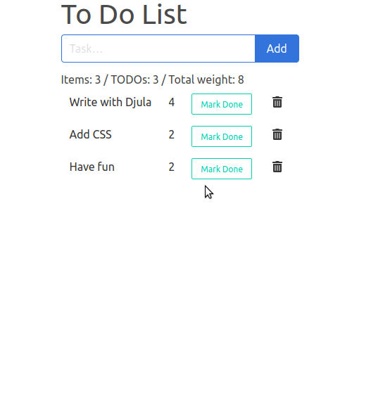

# ISSR-TODO app: a dynamic todo-app without a line of JavaScript

[http://cjackson.tk/todo-tutorial](http://cjackson.tk/todo-tutorial)

Overview: https://github.com/interactive-ssr/client/blob/master/main.org

> What makes ISSR unique is its lack of any kind of client-side programming. Other Server based frameworks allow you write what would normally be written in Javascript onto the server. ISSR goes a step further into the land of declarative programming by moving any interactive changes into the realm of HTML generation (rather than DOM manipulation). The web developer only needs to know HTML and the server-side programming language (and CSS if you want styles); No knowledge about Javascript or DOM is necessary.

ISSR is websockets oriented: if two clients share the same connection and the same session, they view each other's actions at the same time (see the Backgammon tutorial).

## Demo

I did the todo-app again, but with Djula templates (Django-like templates, although more flexible, it's Lisp).

It's time to envision serious things with this library.

This is interactive just as we expect:

missing:

- websockets illustration

## Usage

With Roswell (experimental):

   ros install vindarel/issr-todolist

On the terminal:

    make run
    # aka
    sbcl --non-interactive --load issr-test.asd --eval '(ql:quickload :issr-test)' --eval '(issr-test:main)'

paramaters: `ISSR_PORT` and `ISSR_WS_PORT`.

Manually (Slime):

- load issr-test.asd (C-c C-k)
- (ql:quickload "issr-test")
- (issr-test:main :port xxx :ws-port xyz)

Access http://localhost:8080/products

## Dev

Build a binary with Roswell:

    ros build roswell/issr-test.ros

this builds a binary in the roswell/ directory. You can run it directly.

warn: Roswell doesn't use the same Quicklisp directory as yours but its own, so you maybe don't have the package versions on Slime and with Roswell (unless your editor is set up to use Roswell).

It is when we `ros install foo` that we can run `ros exec foo`.

### Remarks

- We can't update little parts of the DOM. That is not the philosophy of ISSR. To be more precise:

> You can update small parts on the client, but the whole thing is still generated on server, then only small changes are sent to the client.

- How to add transitions on added elements? It seems difficult (it's possible in JS. htmx has workarounds for this).

## See also:

- https://htmx.org/ - similar in scope. We can update precise parts of the DOM, built-in transitions support… Websockets support is "experimental", whereas it is the primary focus of ISSR.

- https://github.com/dbohdan/liveviews
